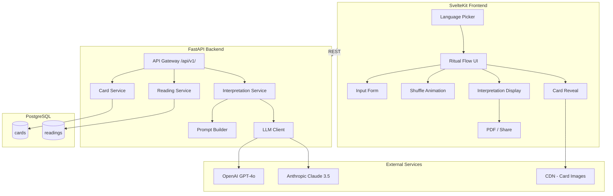

## Context

**Tarô de Raízes** is a greenfield, trilingual tarot reading web application targeting users
in Japan and Brazil. It uses a custom 78-card "Brazilian Roots" deck with AI-generated
interpretations. The system requires a clear architecture separating presentation, business
logic, and AI integration layers.

### Stakeholders

- End users (tarot seekers in Brazil and Japan)
- Product owner / spiritual content curator
- AI prompt engineers
- Frontend and backend developers

### Constraints

- Mobile-first (optimized for LINE browser)
- AI responses must be grounded in card-specific "Brazilian Roots" descriptions
- Trilingual support is a first-class concern, not an afterthought
- Free tier must use the "Gap Technique" to convert users to paid readings

---

## Goals / Non-Goals

### Goals

- Deliver a production-ready MVP with the full ritual flow (input → interpret)
- Support PT-BR, JP, and EN across all user-facing surfaces (UI + AI output)
- Create an immersive, mystic minimalism UI with smooth ritualistic animations
- Implement a robust prompt engineering pipeline for culturally-rich interpretations
- Provide PDF export and social share functionality

### Non-Goals

- User authentication / accounts (Phase 2)
- Payment processing / subscription management (Phase 2)
- Community features (forums, comments)
- Native mobile apps (web-only for MVP)
- Reverse card interpretations (Phase 2)

---

## Architecture

### System Overview



### Layer Responsibilities

| Layer          | Technology               | Responsibility                                              |
| -------------- | ------------------------ | ----------------------------------------------------------- |
| Presentation   | SvelteKit + Tailwind CSS | UI rendering, animations, i18n, PDF generation              |
| API Gateway    | FastAPI                  | Request routing, validation, CORS, rate limiting            |
| Business Logic | Python services          | Card selection, reading session management, prompt assembly |
| AI Integration | OpenAI/Anthropic SDK     | LLM communication, response streaming, fallback handling    |
| Data           | PostgreSQL + SQLAlchemy  | Card storage, reading logs, session persistence             |

---

## Decisions

### D1: SvelteKit + Tailwind CSS for Frontend

- **What:** Use SvelteKit as the frontend framework with Tailwind CSS for styling
- **Why:** Svelte's native transitions (`transition:`, `animate:`) are ideal for the ritualistic card flip and shuffle animations without additional animation libraries. Tailwind provides rapid UI development with consistent design tokens. SvelteKit handles SSR for SEO.
- **Alternatives considered:**
  - Next.js + Framer Motion — heavier bundle, React overhead for animations
  - Astro — less suited for interactive, stateful ritual flows

### D2: FastAPI for Backend

- **What:** Use FastAPI (Python 3.11+) for all API endpoints
- **Why:** Native async support for concurrent LLM calls, built-in OpenAPI docs, Pydantic for request/response validation, excellent Python AI/ML ecosystem integration.
- **Alternatives considered:**
  - Express.js — less natural for Python AI libraries
  - Django REST — heavier framework, less async-native

### D3: Dual LLM Provider Support

- **What:** Support both OpenAI (GPT-4o) and Anthropic (Claude 3.5 Sonnet) as interpretation engines
- **Why:** Provides fallback resilience and allows A/B testing interpretation quality. Provider is configurable via environment variable.
- **Pattern:** Strategy pattern with a common `LLMClient` interface

### D4: Prompt Engineering Strategy

- **What:** Store prompt templates as structured YAML/JSON with per-card grounding data
- **Why:** Separates prompt logic from code, enables non-developer editing of tarot content, supports A/B testing of prompt variants
- **Structure:**
  - System prompt defines the "voice" (wise, non-judgmental, culturally rich)
  - Card-specific context injected from database `keywords_json` field
  - Language-specific formatting instructions
  - Free vs Paid tier differentiation in prompt structure

### D5: PostgreSQL for Data Storage

- **What:** Use PostgreSQL with SQLAlchemy ORM (async)
- **Why:** Relational model fits the structured card data (arcana type, element, trilingual names). JSON columns for flexible keyword storage. Strong support for UUID primary keys and array types.
- **Alternatives considered:**
  - MongoDB — less natural for relational card-arcana hierarchies
  - SQLite — not suitable for concurrent production workload

### D6: Mobile-First, Mystic Minimalism Design

- **What:** Dark-themed, gold-accent UI with warm colors, 3D card flip transitions (`rotateY`), and a mobile-first responsive layout
- **Why:** Matches the spiritual/mystical domain expectations. LINE browser optimization requires careful viewport and touch handling.
- **Design tokens:**
  - Background: deep navy/charcoal (`#0f0f1a`, `#1a1a2e`)
  - Accents: warm gold (`#d4a574`, `#e8c87a`)
  - Text: warm off-white (`#f5f0e8`)
  - Fonts: Serif for headings (e.g., Cormorant Garamond), sans-serif for body (Inter)

---

## Data Model

### Table: `cards`

| Column           | Type             | Description                                                    |
| ---------------- | ---------------- | -------------------------------------------------------------- |
| `id`             | `VARCHAR(50)` PK | Slug identifier (e.g., `the-fool`, `ace-of-wands`)             |
| `name_pt`        | `VARCHAR(100)`   | Card name in Portuguese                                        |
| `name_jp`        | `VARCHAR(100)`   | Card name in Japanese                                          |
| `name_en`        | `VARCHAR(100)`   | Card name in English                                           |
| `arcana_type`    | `VARCHAR(10)`    | `major` or `minor`                                             |
| `suit`           | `VARCHAR(20)`    | Suit for minor arcana (NULL for major)                         |
| `card_number`    | `INTEGER`        | Position within arcana/suit                                    |
| `image_url`      | `TEXT`           | CDN URL for card artwork                                       |
| `keywords_json`  | `JSONB`          | Trilingual keywords: `{"pt": [...], "jp": [...], "en": [...]}` |
| `description_pt` | `TEXT`           | Brazilian Roots description (PT)                               |
| `description_jp` | `TEXT`           | Brazilian Roots description (JP)                               |
| `description_en` | `TEXT`           | Brazilian Roots description (EN)                               |
| `element`        | `VARCHAR(20)`    | Associated element (Fire, Water, Earth, Air)                   |
| `created_at`     | `TIMESTAMPTZ`    | Record creation time                                           |

### Table: `readings`

| Column                | Type           | Description                             |
| --------------------- | -------------- | --------------------------------------- |
| `id`                  | `UUID` PK      | Unique reading identifier               |
| `user_name`           | `VARCHAR(100)` | User-provided name                      |
| `focus_area`          | `VARCHAR(20)`  | `love`, `career`, or `general`          |
| `reading_type`        | `VARCHAR(10)`  | `free` or `paid`                        |
| `cards_drawn`         | `VARCHAR[]`    | Array of card slugs                     |
| `interpretation_text` | `TEXT`         | Full AI-generated interpretation        |
| `language`            | `VARCHAR(5)`   | `pt-br`, `ja`, or `en`                  |
| `llm_provider`        | `VARCHAR(20)`  | Provider used (`openai` or `anthropic`) |
| `llm_model`           | `VARCHAR(50)`  | Model identifier                        |
| `prompt_tokens`       | `INTEGER`      | Input token count                       |
| `completion_tokens`   | `INTEGER`      | Output token count                      |
| `created_at`          | `TIMESTAMPTZ`  | Reading timestamp                       |

---

## API Design

### Endpoint Summary

| Method | Path                        | Description                                         |
| ------ | --------------------------- | --------------------------------------------------- |
| `GET`  | `/api/v1/health`            | Health check                                        |
| `GET`  | `/api/v1/cards`             | List all cards (with optional language filter)      |
| `GET`  | `/api/v1/cards/{slug}`      | Get single card detail                              |
| `POST` | `/api/v1/reading/init`      | Initialize reading session, draw cards              |
| `POST` | `/api/v1/reading/interpret` | Generate AI interpretation (supports SSE streaming) |
| `GET`  | `/api/v1/reading/{id}`      | Retrieve a past reading                             |
| `GET`  | `/api/v1/reading/{id}/pdf`  | Download reading as PDF                             |

### Request/Response Examples

#### POST `/api/v1/reading/init`

```json
// Request
{
  "user_name": "Yui",
  "focus_area": "love",
  "language": "ja",
  "reading_type": "free"
}

// Response
{
  "reading_id": "a1b2c3d4-...",
  "cards_drawn": [
    {
      "slug": "the-lovers",
      "name": "恋人たち",
      "image_url": "https://cdn.example.com/cards/the-lovers.webp",
      "arcana_type": "major"
    }
  ],
  "reading_type": "free",
  "status": "awaiting_interpretation"
}
```

#### POST `/api/v1/reading/interpret`

```json
// Request
{
  "reading_id": "a1b2c3d4-...",
  "stream": true
}

// Response (SSE stream)
data: {"chunk": "As cartas revelam..."}
data: {"chunk": " um momento de profunda..."}
data: {"done": true, "total_tokens": 450}
```

---

## Prompt Engineering Architecture

### System Prompt Structure

```
[ROLE] You are a wise tarot reader of the "Tarô de Raízes" tradition...
[VOICE] Speak with warmth, wisdom, and cultural reverence...
[LANGUAGE] Respond in {language}...
[TIER] {free_constraints | paid_constraints}
[CARD_CONTEXT] Card: {name}, Keywords: {keywords}, Description: {description}
[FOCUS] The seeker asks about: {focus_area}
[INSTRUCTION] Provide a {tier_specific_format} interpretation...
```

### Per-Tier Prompt Differences

| Aspect    | Free                           | Paid                                                     |
| --------- | ------------------------------ | -------------------------------------------------------- |
| Length    | 150-250 words                  | 600-1000 words                                           |
| Structure | Single insight paragraph       | Structured (Overview → Each Card → Synthesis → Guidance) |
| Depth     | Surface-level with "gap" tease | Deep emotional/spiritual analysis                        |
| CTA       | "For a complete reading..."    | Gratitude + encouragement                                |
| Cards     | 1 card                         | 3 cards (Past / Present / Future)                        |

---

## Risks / Trade-offs

| Risk                      | Impact                      | Mitigation                                             |
| ------------------------- | --------------------------- | ------------------------------------------------------ |
| LLM API downtime          | Readings fail               | Dual-provider fallback (OpenAI ↔ Anthropic)            |
| LLM hallucination         | Inaccurate/generic readings | Ground prompts in card-specific descriptions           |
| High LLM costs            | Budget overrun              | Token counting, caching common patterns, rate limiting |
| LINE browser quirks       | Broken animations/layout    | Progressive enhancement, CSS fallbacks                 |
| Trilingual prompt quality | Poor JP/EN interpretations  | Native-speaker review of prompt templates              |
| Card image loading        | Slow mobile UX              | WebP format, lazy loading, CDN with edge caching       |

---

## Migration Plan

Not applicable — greenfield project.

---

## Open Questions

1. **Card artwork:** Will the 78 card images be provided, or should placeholders be used for MVP?
2. **Payment integration:** Stripe, Mercado Pago, or other? (Deferred to Phase 2)
3. **Analytics:** Should we track reading patterns for content improvement?
4. **Rate limiting:** What's the acceptable free-tier rate limit per IP/session?
5. **Data retention:** How long should reading logs be retained?
